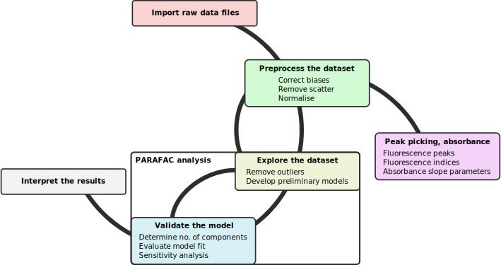
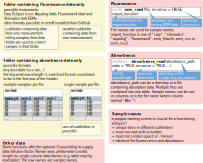

```{r, message=FALSE, warning=FALSE, include=FALSE}
### BEWARE! ###
# This Rmd file was created to supply a tutrial for staRdom.
# Several steps in here are not part of the actual analysis but to create a nice looking and smoothly created
# tutorial file. Starting your PARAFAC analysis from this Rmd file is therefore not adviced. If you do so, you
# have to distinguish between the steps necessary for the analysis and those necessary for a nice tutorial.
# If you encounter troubles or you do not know, what this means please start with a fresh, plain R script, read
# the turial and use the code provided there!

library(knitr)
library(kableExtra)
cores <- 2
```

{width=180}

# Introduction
staRdom is a package for R version `r R.Version()$major` [@r_development_core_team_r:_2019] to analyse fluorescence and absorbance data of dissolved organic matter (DOM). The important features are:

# Introduction
staRdom is a package for R version [@r_development_core_team_r:_2019] to analyse fluorescence and absorbance data of dissolved organic matter (DOM). The important features are:

* separating the components of the EEMs via PARAFAC/CANDECOMP [@murphy_fluorescence_2013; @bro_parafac_1997; @helwig_multiway_2019].
* validating the model using a split-half analysis, the core consistency, the model fit or visually examining the residuals
* correcting excitation-emission-matrices [@murphy_fluorescence_2013; @massicotte_eemr_2019]
* calculating fluorescence peaks and indices [@massicotte_eemr_2019]
* autochthonous productivity index / freshness index [BIX; @huguet_properties_2009; @fellman_fluorescence_2010]
* classical peaks based on manual peak picking [B, T, A, M, C; @coble_characterization_1996]
* fluorescence index [FI; @mcknight_spectrofluorometric_2001]
* humification index [HIX; @ohno_fluorescence_2002]
* calculating common absorbance (slope) parameters:
    * absorbance at 254 nm [a254; @dobbs_use_1972],
    * absorbance at 300 nm [a300; @molot_effect_2005],
    * ratio of absorbance at 250 to 365 nm [E2:E3; @de_haan_applicability_1987],
    * ratio of absorbance at 465 to 665 nm [E4:E6; @summers_molecular_1987],
    * spectral slope within log-transformed absorption spectra range (S275-295, S350-400, S300-700) and the ratio of S275-295 to S350-400 (SR) [@helms_absorption_2008],
    * the wavelength distribution of absorption spectral slopes [@loiselle_optical_2009] and
    * user-defined values and slopes can be extracted or calculated from the absorbance spectra.

staRdom has been developed and is maintained at WasserCluster Lunz (http://www.wcl.ac.at/) and the University of Natural Resources and Life Sciences, Vienna(http://www.boku.ac.at/).

A comparison in quality of results and performance of the PARAFAC algorithms in staRdom and drEEM can be found in Pucher et al. [-@pucher_stardom_2019]. The analysis process was developed and discussed in other papers and tutorials [e.g. @murphy_fluorescence_2013]. The aim of this package is to provide an elaborate and flexible way of using PARAFAC analysis of EEM data on the R platform. The offered functions follow the concept of Murphy et al. [-@murphy_fluorescence_2013]. We strongly recommend to read this paper to understand the underlying procedure of the analysis.

For easy data correction and calculations of peaks, indices and slope parameters in R but without using R functions and codes please see [vignette for basic analysis](Basic_analysis_of_DOM_samples.html). We use functions from the R package eemR, for information on eemR and its functions please see the [eemR vignette](https://CRAN.R-project.org/package=eemR). Details on the actual PARAFAC calculation can be found in the [multiway documentation](https://CRAN.R-project.org/package=multiway).

This tutorial was created using R version `r R.Version()[c("major","minor")] %>% paste0(collapse=".")` and the packages dplyr [@wickham_dplyr_2020] and tidyr [@wickham_tidyr_2020].
```{r message=FALSE, warning=TRUE}
library(dplyr)
library(tidyr)
```

## Aim of this document

> This document describes a complete fluorescence and absorbance analysis of example data using R functions and offers a variety of options and ways to gain validated results.

## Remark on errors and warnings
In R, there can be errors and warnings. Errors stop the calculations and no results are returned because of a severe problem. Warnings do not stop calculations but are hints, that something unusual happened. If you encounter any warnings please think of the reason. In some cases, this reason might be in-line with what you want and is no problem at all. An examples for a not serious warnings are interpolated values because of missing wavelengths or NAs introduced by coercion in some cases. Please have a look at your data to find actual problems.

## Install and load staRdom
staRdom can be installed directly from a CRAN repository:
```{r eval=FALSE, include=TRUE}
install.packages("staRdom")
```
You can also install staRdom from GitHub. The version on GitHub is sometimes a more recent one.
```{r eval=FALSE, include=TRUE}
install.packages("devtools") # Run this only, if devtools is not installed already.
devtools::install_github("MatthiasPucher/staRdom")
```
staRdom can then be loaded:
```{r eval=TRUE, include=TRUE}
library("staRdom")
```


## Parallel processing

Some of the functions can use several CPU cores in parallel to speed up the calculations. You can set the number of parallel processes to be used.
In tests, best results were achieved setting `cores` to the number of physical cores in your computer. Using virtual cores introduced by Hyper-threading did increase calculation times again. `detectCores(logical = FALSE)` will give you the appropriate number. On some computers this function returns the number of virtual cores, which has to be checked and set manually then.

```{r eval=FALSE, include=TRUE}
cores <- detectCores(logical = FALSE)
```

## Overview of analysis steps

The diagram below shows the most important steps in the analysis of fluorescence and absorbance data to identify DOM parameters. After importing the data and applying the desired correction steps, peaks, indices and absorbance parameters can be calculated. Besides that, after the data correction, compounds can be separated using a PARAFAC model. The PARAFAC model development includes cyclical steps to come to a satisfying result. Model validation is very important at that point to get trustful results. As a last step, the compounds determined in the model can be linked to already published ones or other experimental data and by that interpreted in a biogeochemical context.

{width=100%}

# Example data coming with the package

You can run a complete data correction and analysis as shown in this example with the data provided by the package and downloaded within the tutorial. However, you can start the tutorial with your own data right away. The function `system.file()` used below returns the folders, where the example data is stored in. In case you use your own, you can just type in the path to your data as a string (e.g. "C:/folder/another folder") without using `system.file`. 

## Raw EEM data

The example EEM data is saved in a folder and accessible by `system.file("extdata/EEMs", package = "staRdom")`. Due to package size issues, only a small amount of samples is included and for a complete reproduction of the PARAFAC analysis demonstrated below, the drEEM data has to be downloaded (see below how to accomplish that).

## Raw absorbance data

The absorbance data is saved in a folder accessible by `system.file("extdata/absorbance", package = "staRdom")`.

## Additional raw data

There is a table with data on diluted samples included. The table can serve as an example in case you worked with diluted samples. It is saved in a folder accessible by `system.file("extdata/metatable_dreem.csv", package = "staRdom")`.

## Corrected EEM data

The corrected EEM data set is loaded from the drEEM website.

## PARAFAC model

An already calculated PARAFAC model was included in the package. It can be loaded into the R environment by `data(pf_models)`.

# Import raw data

For a complete analysis in staRdom you need fluorescence and absorbance data. In many cases also a metatable is needed. Reading and linking the data needs some preparations and attention. Below we show how to import these data using the provided example data.

{width=100%}

EEM data import is done with `eem_read` (package eemR). Currently you can use it to import from Varian Cary Eclipse, Horiba Aqualog, Horiba Fluoromax-4, Shimadzu and Hitachi F-7000 instruments as well as generic csv files.

```{r eval=TRUE, include=TRUE}
folder <- system.file("extdata/EEMs/", package = "staRdom") # folder containing example EEMs
eem_list <- eem_read(folder, recursive = TRUE, import_function = eem_csv) # in case you use your own data, just replace folder by a path. e.g. "C:/folder/another folder" and change import_function according to instrument.
```

This is an example to load data from instrument specific ASCII files. `import_function` has to be set accordingly: Varian Cary Eclipse (`"cary"`), Horiba Aqualog (`"aqualog"`), Horiba Fluoromax-4 (`"fluoromax4"`), Shimadzu (`"shimadzu"`), Hitachi F-7000 (`eem_hitachi`) and generic csv files (`eem_csv` when excitation wavelengths are in columns or `eem_csv2` when emission wavelengths are in columns). Please note, `eem_hitachi`, `eem_csv` and `eem_csv2` are without hyphens!
```{r eval=FALSE, include=TRUE}
eem_list <- eem_read(folder, import_function = "cary")
```

If your instrument is not amongst the mentioned ones, eemR offers the opportunity to create custom import functions ([see according vignette](https://cran.r-project.org/package=eemR)).

To have a look at your data, you can plot the samples in several plots using `eem_overview_plot`. `ggeem` is another function that plots EEMs, but it produces only one plot, which can be overloaded in case of many samples. `spp` defines the number of samples per plot. Not present data is not shown (light greyish), NAs are dark grey. `contour = TRUE` adds contour lines to the EEM plots.
```{r eval=TRUE, fig.width = 6, fig.height = 5, message=FALSE, warning=FALSE, include=TRUE, paged.print=TRUE}
eem_overview_plot(eem_list, spp=9, contour = TRUE)
```

Absorbance data is imported with `absorbance_read`. It is read from CSV or TXT files. `absorbance_path` is either a directory and all files in there are read in, or a single file that is read in. Tables can either contain data from one sample or from several samples in columns. The first column is considered the wavelength column. A multi-sample file must have sample names as column names. All tables are combined to one with one wavelength column and one column for each sample containing the absorbance data.

```{r eval=TRUE, include=TRUE}
absorbance_path = system.file("extdata/absorbance", package = "staRdom") # load example data, set a path without using system.file to use your own data e.g. "C:/folder/another folder"
```

To load the data, please use:
```{r eval=TRUE, include=TRUE}
absorbance <- absorbance_read(absorbance_path, cores = cores) # load csv or txt tables in folder
```

In some cases, it is necessary to use individual dilution factors, Raman areas or pathlengths. This data is read using the base R function read.table. Please check that the column separator of your file is the same as in read.table (sep, which is defined as blank space here, hence sep = “ “). The same is true for the decimal separator of your numbers (dec, which is defined as dec = “,” in our case). Here, we import a table containing meta data provided with the package as an example. In the example only dilution data is provided via this table.

```{r eval=TRUE, include=TRUE}
metatable <- system.file("extdata/metatable_dreem.csv",package = "staRdom") # path to example data, can be replaced by a path to your own data
meta <- read.table(metatable, header = TRUE, sep = ",", dec = ".", row.names = 1) # load data
```

If you have not created a table containing meta data, you can use `eem_metatamplate` to create a new one. It can be written to a file using `write.csv`. Here is an example:

```{r eval=FALSE, include=TRUE}
eem_metatemplate(eem_list, absorbance) %>%
  write.csv(file="metatable.csv", row.names = FALSE)
```

## Check data
The `eem_checkdata` function prints out sample names and folders, where possible problems are detected. Additionally a named list with these sample names can be saved (variable `problem` in the example code below).

The data can be checked for possible incorrect entries (in brackets names of the according list elements):

* NAs ([‘Not Available’ / missing values](https://stat.ethz.ch/R-manual/R-devel/library/base/html/NA.html)) in data (`NAs_in_EEMs`)

* wavelength range mismatches (in-between EEMs: `EEMs_more_data_than_smallest`, absorbance spectrum smaller than EEM spectrum: `EEM_absorbance_wavelength_range_mismatch`). Concerning wavelength spectra, only the range is important since values in-between are interpolated automatically for absorbance data and can be interpolated manually for different EEM samples using the function `eem_extend2largest` with `interpolation = TRUE`.

* missing data (EEM but no absorbance: `EEMs_missing_absorbance`, absorbance but no EEM: `Absorbance_missing_EEMs`, EEM but no metadata: `EEMs_missing_metadata`,metadata but no EEM: `Metadata_missing_EEMs`)

* inconsistencies (duplicates, invalid)in samples names between EEM, absorbance and metadata (e.g. samples missing in one of the three sets), (`Duplicate_EEM_names`, `Duplicate_absorbance_names`, `invalid_EEM_names`, `invalid_absorbance_names`,`Duplicates_metatable_names`)

* not applied correction methods (`missing_data_correction`).

`Possible_problem_found` is a logic variable in the list, stating whether a possible problem was found or not.

In case of problems, you need to reorganise your data manually and revise the steps mentioned above. The `eem_checkdata` function can be run any time during the process to see if any changes in the dataset caused inconsistencies. No correction of these problems is done automatically!

```{r eval=TRUE, include=TRUE}
problem <- eem_checkdata(eem_list,absorbance,meta,metacolumns = c("dilution"),error=FALSE)
```

EEM data can contain NAs to perform a PARAFAC analysis as long as there is a certain amount of numeric values present. Depending on the data set, more than 15 to 20 % might cause non-converging models or models converging in a lokal minimum. We always suggest an interpolation of the data to get good results and a stable PARAFAC modelling process [@elcoroaristizabal_parafac_2015].

Different EEM sizes are not a problem, because there is a way to address this as shown below. For a blank subtraction or a PARAFAC analysis, the available data for each sample must be similar.

The above mentioned absence of absorbance data for the blank samples can be justified, as absorbance of ultrapure water is theoretically 0 over the complete spectrum. In the further analysis, this is no problem.

# Data preparation and correction

If you have used the template for the peak picking ([vignette for basic analysis](Basic_analysis_of_DOM_samples.html)), the correction is already done and you can start a PARAFAC analysis with the `eem_list` resulting from this template.

## Sample names

If you want to change your sample names, you can use `eem_name_replace`. In the example, "(FD3)" is removed as it is not part of the samples names but originates from the conversion of Hitachi FD3 files to txt files. You can use this function for any replacement in file names. Regular expressions (please see the [help on regular expressions](https://stat.ethz.ch/R-manual/R-devel/library/base/html/regex.html)) can be used in search and replace patterns provided.

```{r eval=TRUE, include=TRUE}
eem_list <- eem_name_replace(eem_list,c("\\(FD3\\)"),c(""))
```

## Absorbance baseline correction

The instrumental baseline drift in absorbance data can be corrected by subtracting the mean of the absorbance at high wavelengths [@li_utilization_2017]. The default is to use the spectrum between 680 and 700 nm but any other range can be set manually.

```{r eval=TRUE, include=TRUE}
absorbance <- abs_blcor(absorbance,wlrange = c(680,700))
```

## Spectral correction
Spectral correction is done to remove instrument-specific influences on the EEMs [@derose_recommendations_2010]. Some instruments can do this automatically. The example EEMs are corrected using `eem_spectral_cor`. Correction vectors have to be provided in the same range as the EEM measurements. If this is not the case, the EEMs can be cut to this range using `eem_range`.

```{r eval=TRUE, include=TRUE}
excorfile <- system.file("extdata/CorrectionFiles/xc06se06n.csv",package="staRdom")
Excor <- data.table::fread(excorfile)

emcorfile <- system.file("extdata/CorrectionFiles/mcorrs_4nm.csv",package="staRdom")
Emcor <- data.table::fread(emcorfile)

# adjust range of EEMs to cover correction vectors
eem_list <- eem_range(eem_list,ex = range(Excor[,1]), em = range(Emcor[,1]))

eem_list <- eem_spectral_cor(eem_list,Excor,Emcor)
```

## Blank subtraction

Blanks are samples of ultrapure water that must contain either "nano", "miliq", "milliq", "mq" or "blank" in their file names. They can be used to apply blank subtractionand Raman normalisation (see below) and are used for samples in the same (sub)folders. If multiple blanks were measured, they are averaged. The example data consist of only two folders with one blank each. Blanks are subtracted from each sample to reduce the effects of scatter bands and systematic errors [@murphy_fluorescence_2013].

The blanks must be the same size as the samples they will be subtracted from. As different sample sizes were reported above, all samples will be brought to the same data range before. You can find a description on data and wavelength ranges below.

```{r eval=TRUE, include=TRUE}
# extending and interpolation data
eem_list <- eem_extend2largest(eem_list, interpolation = 1, extend = FALSE, cores = cores)

# blank subtraction
eem_list <- eem_remove_blank(eem_list)
```

```{r eval=TRUE, fig.width=6, fig.height = 5, message=FALSE, warning=FALSE, include=TRUE, paged.print=TRUE}
eem_overview_plot(eem_list, spp=9, contour = TRUE)
```

## Inner-filter effect correction

Inner-filter effects (IFE) occur when excitation light is absorbed by chromophores. A simple method to correct the IFE is to use the sample's absorbance. The EEM is multiplied by a correction matrix corresponding to each wavelength pair [@kothawala_inner_2013]. In case of a maximum absorbance larger than 1.5 cm⁻¹, the sample needs to be diluted, because the absorbance is to high to be corrected by the applied IFE function (or mathematical IFE correction in general). The example uses a path length of 5 cm (5 cm long cuvettes) for absorption measurements.

In the example below, there is a warning about no absorbance data for the blank samples. This warning is not a problem because in ultrapure water samples there is practically no IFE and the sample is removed in the further analysis.

```{r eval=TRUE, include=TRUE}
eem_list <- eem_ife_correction(eem_list,absorbance, cuvl = 5)
```
```{r eval=TRUE, fig.width=6, fig.height = 5, message=FALSE, warning=FALSE, include=TRUE}
eem_overview_plot(eem_list, spp=9, contour = TRUE)
```

## Raman normalisation

Fluorescence intensities can differ between analyses on different fluorometers, different settings or different days on the same fluorometer. Therefore it can be normalised to a standard scale of Raman Units by dividing all intensities by the area of the Raman peak of a ultrapure water sample. All fluorescence intensities are divided by the area (integral) of the Raman peak (excitation of 350 nm between an emission of 371 nm and 428 nm) [@lawaetz_fluorescence_2009]. Values are interpolated if the wavelengths are missing.

You can use blanks, numeric values or data frames as source for the values. In case you use blank samples, again the blanks in the same sub-folder as the sample are used. Blanks are recognised by having "blank", "miliq", "milliq", "nano" or "mq" in the file name. This means regular samples must not have it.

```{r eval=TRUE, include=TRUE}
eem_list <- eem_raman_normalisation2(eem_list, blank = "blank")
```

```{r eval=TRUE, fig.width=6, fig.height = 5, message=FALSE, warning=FALSE, include=TRUE}
eem_overview_plot(eem_list, spp=9, contour = TRUE)
```

Raman areas can be calculated separately with the function `eem_raman_area`.

## Remove blanks from sample set

From this step onwards, blanks are not needed anymore. You can remove them from your sample set. `eem_extract` removes all samples including "nano", "miliq", "milliq", "mq" or "blank" in their sample names. `select` of the package dplyr can do the same for the absorbance data.

```{r eval=TRUE, include=TRUE}
eem_list <- eem_extract(eem_list, c("nano", "miliq", "milliq", "mq", "blank"),ignore_case = TRUE)

absorbance <- dplyr::select(absorbance, -matches("nano|miliq|milliq|mq|blank", ignore.case = TRUE))
```

## Remove and interpolate scattering

The function removes scattering from the samples. `remove_scatter` is a logical vector where values are ordered by the meaning of "raman1", "raman2", "rayleigh1" and "rayleigh2". `remove_scatter_width` is either a number or a vector containing 4 different wavelength width in nm, one for each scatter type [@murphy_fluorescence_2013; @lakowicz_principles_2006].

```{r eval=TRUE, include=TRUE}
remove_scatter <- c(TRUE, TRUE, TRUE, TRUE)
remove_scatter_width <- c(15,15,15,15)

eem_list <- eem_rem_scat(eem_list, remove_scatter = remove_scatter, remove_scatter_width = remove_scatter_width)
```

```{r eval=TRUE, fig.width=6, fig.height = 5, message=FALSE, warning=FALSE, include=TRUE}
eem_overview_plot(eem_list, spp=9, contour = TRUE)
```

Although it is not always necessary, removed scatter areas should be interpolated for reasonable results and faster calculation in the PARAFAC analysis [@elcoroaristizabal_parafac_2015]. `eem_interp` offers different methods of interpolation. The types of interpolation are (0) setting all NAs to 0, (1) spline interpolation with `mba.points` [@lee_scattered_1997], (2) excitation and emission wavelength-wise interpolation with `pchip` [@moler_numerical_2004] and subsequent `mean`, (3) excitation wavelength-wise interpolation with `pchip` and (4) linear excitation and emission wavelength-wise interpolation with `na.approx` and again subsequent `mean` calculation. Calculating the mean is a way of ensuring NAs are also interpolated where missing boundary values would make that impossible. In case of interpolation type 1, `extend = FALSE` prevents the function from extrapolating. We recommend to use type 1 as a start, because its accuracy in interpolating surfaces. The smooth but still complex surface is exactly what one would expect from a theoretical EEM. In case of recognisable patterns in the residual plots close to the scatter areas or many not converging initialisations of the PARAFAC model, another interpolation method could improve the results.

```{r eval=TRUE, include=TRUE}
eem_list <- eem_interp(eem_list, cores = cores, type = 1, extend = FALSE)
```

```{r eval=TRUE, fig.width=6, fig.height = 5, message=FALSE, warning=FALSE, include=TRUE}
eem_overview_plot(eem_list, spp=9, contour = TRUE)
```

## Correct for dilution

Data are corrected for dilution via `eem_dilution`. Each EEM is multiplied with a dilution factor (e.g. 10 if 1 part sample was diluted with 9 parts ultrapure water). Either a single numeric value for all samples or a table with a specific value for each sample is used.

This step can also be done manually after calculating peaks, indices and PARAFAC components. By that, a slightly different result has to be expected if EEMs are not normalised prior to creating a PARAFAC model. In other cases there is no difference whether EEMs or results are multiplied by the dilution factor.

```{r eval=TRUE, include=TRUE}
dil_data <- meta["dilution"]

eem_list <- eem_dilution(eem_list,dil_data)
```

```{r eval=FALSE, fig.width=7, message=FALSE, warning=FALSE, include=TRUE, paged.print=TRUE}
eem_overview_plot(eem_list, spp=9) # plot spared, due to no dilution it looks like the previous plot.
```

## Smooth data

Depending on your instrument, smoothing the data could be beneficial for peak picking. For PARAFAC analysis smoothing is not advised. The parameter `n` specifies the moving average window size in nm. 

```{r eval=TRUE, include=TRUE}
eem4peaks <- eem_smooth(eem_list, n = 4, cores = cores)
```

```{r eval=FALSE, fig.width=7, message=FALSE, warning=FALSE, include=FALSE, paged.print=TRUE}
eem_overview_plot(eem4peaks, spp=6)
```

## Overview of samples
`summary` prints an overview of the samples containing data ranges, applied correction methods and the manufacturer of the instrument.

```{r}
summary(eem_list)
```


```{r eval=FALSE, include=FALSE}
eem_list %>%
  summary() %>%
  kable(format = "latex", booktabs = T) %>%
  kable_styling(bootstrap_options = c("striped", "hover"), full_width = FALSE) %>%
  #kable_styling(font_size = 5) %>%
  row_spec(0, angle = -45) #%>%
```

# Peak picking and indices

Peaks and indices known from the literature [@huguet_properties_2009; @zepp_dissolved_2004; @mcknight_spectrofluorometric_2001; @ohno_fluorescence_2002] can be  calculated.

If wavelength ranges needed for certain indices or peaks (e.g. the humification index (HIX) uses an excitation wavelength of 254 nm, but EEMs usually contain measurements at 250 and 255 nm) an interpolation is done automatically between existing measurements (no extrapolation!). This will be reported with warnings, however, these warnings can be ignored. The smoothed EEMs `eem4peaks` are used for the calculation. To extract individual peaks, the function `eem_peaks` can be used.

```{r eval=TRUE, warning=FALSE, include=TRUE}

bix <- eem_biological_index(eem4peaks)
coble_peaks <- eem_coble_peaks(eem4peaks)
fi <- eem_fluorescence_index(eem4peaks)
hix <- eem_humification_index(eem4peaks, scale = TRUE)

indices_peaks <- bix %>%
  full_join(coble_peaks, by = "sample") %>%
  full_join(fi, by = "sample") %>%
  full_join(hix, by = "sample")

indices_peaks
```

```{r eval=FALSE, include=FALSE, echo=FALSE}
kable(indices_peaks %>% mutate_if(is.numeric,prettyNum,digits = 2,format="fg"),format = "latex", booktabs = T) %>%
  kable_styling(bootstrap_options = c("striped", "hover"), full_width = FALSE) %>%
  #kable_styling(font_size = 5) %>%
  row_spec(0, angle = 45) #%>%
```

# Absorbance indices

`abs_parms` can be used to calculate a254, a300, E2:E3, E4:E6, S275-295, S350-400, S300-700, SR and the wavelength distribution of absorption spectral slopes [@helms_absorption_2008; @twardowski_modeling_2004; @massicotte_cdom_2016; @loiselle_optical_2009]. Li and Hur [-@li_utilization_2017] give a broad overview of possible values and their applications used in recent literature. Missing wavelengths, needed for certain indices or ratios are interpolated automatically.

```{r eval=TRUE, include=TRUE}
slope_parms <- abs_parms(absorbance, cuvl = 1, cores = cores)
slope_parms
```

```{r eval=FALSE, include=FALSE, echo=FALSE}
kable(slope_parms %>% mutate_if(is.numeric,prettyNum,digits = 2,format="fg"),format = "latex", booktabs = T) %>%
  #kable_styling(bootstrap_options = c("striped", "hover"), full_width = FALSE) %>%
  #kable_styling(font_size = 5) %>%
  row_spec(0, angle = 45) #%>%
```

# Creating a PARAFAC model

Finding an appropriate PARAFAC model is an iterative process. For comparing different methods, we used the same dataset and analysis procedure as in the drEEM tutorial which is a supplement to Murphy et al. [-@murphy_fluorescence_2013].

## Loading data

### Load drEEM example dataset
For this tutorial the drEEM example data is used. The complete and corrected data is downloaded from http://models.life.ku.dk/drEEM and converted into an eemlist in R. The example PARAFAC models are calculated based on this complete sample set. You can also adapt that code to import any Matlab EEM data to staRdom.

```{r eval=FALSE, include=TRUE}
dreem_raw <- tempfile()
download.file("http://models.life.ku.dk/sites/default/files/drEEM_dataset.zip",dreem_raw)
dreem_data <- unz(dreem_raw, filename="Backup/PortSurveyData_corrected.mat", open = "rb") %>%
  R.matlab::readMat()
unlink(dreem_raw)

eem_list <- lapply(dreem_data$filelist.eem, function(file){
  #file <- dreem_data$filelist.eem[1]
  n <- which(dreem_data$filelist.eem == file)
  file <- file %>%
    gsub("^\\s+|\\s+$", "", .) %>% # trim white spaces in filenames
    sub(pattern = "(.*)\\..*$", replacement = "\\1", .) # remove file extension from sample name
  eem <- list(file = paste0("drEEM/dataset/",file),sample = file,x = dreem_data$XcRU[n,,] %>% as.matrix(),ex = dreem_data$Ex %>% as.vector(), em = dreem_data$Em.in %>% as.vector(), location = "drEEM/dataset/")
  class(eem) <- "eem"
  attr(eem, "is_blank_corrected") <- TRUE
  attr(eem, "is_scatter_corrected") <- FALSE
  attr(eem, "is_ife_corrected") <- TRUE
  attr(eem, "is_raman_normalized") <- TRUE
  attr(eem, "manufacturer") <- "unknown"
  eem
}) %>%
  `class<-`("eemlist")

# add sample name suffix, R has sometimes troubles, when sample names start with a number.
eem_names(eem_list) <- paste0("d",eem_names(eem_list))
```

In the drEEM tutorial, all samples containing "bl" or "0A" are removed from the set.

```{r eval=FALSE, include=TRUE}
ol <- function(x){x==("bl") | x == "0A"}
extract <- dreem_data$sites %>% unlist() %>% ol() %>% which()
eem_list <- eem_list %>% eem_extract(extract)
```

```{r message=FALSE, warning=FALSE, include=FALSE}
data(eem_list) # load example from staRdom package, this is just necessary for the actual tutorial creation. Remove this line, if you downloaded the drEEM dataset right above and want to use that.
eem_ex <- eem_extract(eem_list,sample ="^d667sf$",keep=TRUE)
```

Scattering has still to be removed and is done as described above.
```{r include = TRUE, eval = TRUE}
eem_list <- eem_rem_scat(eem_list, remove_scatter = c(TRUE, TRUE, TRUE, TRUE), remove_scatter_width = c(15,15,18,19), interpolation = FALSE, cores = cores)
```
```{r include = FALSE, eval = TRUE}
eem_ex <- eem_ex %>% 
  eem_extract(sample = "^d667sf$", keep = TRUE) %>%
  eem_rem_scat(eem_ex, remove_scatter = c(TRUE, TRUE, TRUE, TRUE), remove_scatter_width = c(15,15,18,19), interpolation = FALSE, cores = cores) %>%
  `eem_names<-`("d667sf_2_scatter") %>%
  eem_bind(eem_ex,.)
```
If you have worked with the [basic analysis template](Basic_analysis_of_DOM_samples.html), you can use the resulting data right away. In the case you did the corrections with different sample sets separately and want to combine them, you can use `eem_import_dir` to combine EEM samples from several RData or RDa files. Put all files in one folder and run the following:

```{r include=TRUE,eval=FALSE}
eem_list <- eem_import_dir(dir)
```

Due to package size issues, no example data is included for this function.

We recommend using `eem_checkdata` again before continuing the further analysis!

## Sample set wavelength ranges
For a PARAFAC analysis, all samples of the set need to be similar in terms of provided wavelength pairs. In case you have deviating samples there are ways to solve this:

* `eem_extend2largest` adds NAs if values present in another sample are missing (e.g. different wavelength slits or spectra ranges were used). These values can be interpolated.

* `eem_red2smallest` removes wavelengths, that are missing in at least one sample form the whole set.

## Find and remove noise in EEM data

An important way of finding noise in EEM data is viewing the samples. You can use the function `eem_overview_plot` to view all your samples in a convenient way. 
With the following functions, data can be removed or set to NA (NAs are theoretically no problem for the PARAFAC algorithm, but the calculation process and the results are often more convient without) in different ways, or be interpolated, depending on what you would like to do:

* `eem_extract` removes whole samples either by name or by number.

* `eem_range` removes data outside the given wavelength ranges in all samples.

* `eem_exclude` removes data from the sample set, provided by a list.

* `eem_rem_scat` and `eem_remove_scattering` are used to set data in Raman and Rayleigh scattering of 1st and 2nd order to NA. While the later on removes one scattering at a time, the first one wraps it up to remove several scatterings in one step.

* `eem_setNA` replaces data by NA in rectangular shape and in specific samples.

* `eem_matmult` multiplies each EEM matrix by a certain matrix. This matrix can be used to set parts of the data to 0 or NA (e.g. the area where emission wavelength is shorter than excitation wavelength).

* `eem_interp` is used to interpolate data previously set to NA.

Sample "d667sf" will be used to show this process graphically. To extract the sample the [regular expression](https://stat.ethz.ch/R-manual/R-devel/library/base/html/regex.html) "^d667sf$" is used. ^ stands for the beginning of the string and \$ for the end and ensure an exact match. If you do not use these characters, all samples containing the string in their name are extracted.

This is where we start from:

```{r include=TRUE, eval = FALSE}
eem_list %>% 
  eem_extract(sample = "^d667sf$", keep = TRUE) %>%
  ggeem(contour = TRUE)
```

```{r include=FALSE, eval = TRUE}
eem_ex %>% 
  ggeem(contour = TRUE)
```

The noisy range below 250 nm excitation and above 580 nm emission can be removed from the samples with the following command. As mentioned above, this was already removed in the example data.

```{r eval=TRUE}
eem_list <- eem_list %>% eem_range(ex = c(250,Inf), em = c(0,580))
```

```{r message=FALSE, warning=FALSE, include=FALSE}
eem_ex <- eem_ex %>% 
  eem_extract(sample = "^d667sf_2_scatter$", keep = TRUE) %>%
  eem_range(ex = c(250,Inf), em = c(0,580)) %>%
  `eem_names<-`("d667sf_3_cut") %>%
  eem_bind(eem_ex,.)
```

Visually found irregularities in patterns are manually replaced by NA and interpolated. From the sample "d667sf" a band covering the excitation wavelengths from 245 to 350 is removed and a rectangle covering emission wavelengths 560 to 576 and excitation wavelengths 280 to 295 is removed in all samples. For demonstration reasons, the interpolation is done in an extra step but can also be included in the removing function right away (`interpolate = TRUE`).

```{r eval = TRUE, message = FALSE, warning = FALSE, include = FALSE}
eem_ex <- eem_ex %>%
  eem_extract(sample = "^d667sf_3_cut$", keep = TRUE) %>%
  eem_setNA(sample = 1, ex = 345:350, interpolate = FALSE) %>% # sample 1 in staRdom data is sample 176 in drEEM data!
  eem_setNA(em = 560:576, ex = 280:295, interpolate = FALSE) %>%
  `eem_names<-`("d667sf_4_rem_noise") %>%
  eem_bind(eem_ex,.) 
```

```{r include=TRUE, eval=TRUE}
eem_list <- eem_list %>%
  eem_setNA(sample = 176, ex = 345:350, interpolate = FALSE) %>%
  eem_setNA(em = 560:576, ex = 280:295, interpolate = FALSE)
```

```{r eval = TRUE, include = TRUE}
eem_list <- eem_interp(eem_list, type = 1, extend = FALSE, cores = cores)
```
```{r message=FALSE, warning=FALSE, include=FALSE}
eem_ex <- eem_ex %>% 
  eem_extract(sample = "^d667sf_4_rem_noise$", keep = TRUE) %>%
  eem_interp(type = 1, extend = FALSE, cores = cores) %>%
  `eem_names<-`("d667sf_5_interp") %>%
  eem_bind(eem_ex,.)
```

Here, we show the changes, made to sample d667sf by the demonstrated steps above (including the removing of the scatter):
```{r echo=FALSE, message=FALSE, warning=FALSE, fig.width=6, fig.height = 4}
ggeem(eem_ex, contour = TRUE)
```

## Explore dataset

It is crucial to find an appropriate number of components in the analysis. If the number of components is too large, it may be the case that one component was split into two; if it is too low, relevant components may get lost [@murphy_fluorescence_2013]. To help you find the appropriate number, a series of PARAFAC models can be calculated and compared. In this example 5 models with 3 to 7 components are calculated.

The alternating-least-squares algorithm used to calculate the PARAFAC model optimises the components in order to minimise the residual error. The goal is to find a global minimum of the residual function. Depending on the random start values (random initialisation), different local minima can be found. To get the global minimum, a defined number `nstart` of initialisations is used for separate model calculations. The model with the smallest error is then used for further analyses, assuming it is a global minimum. 25 might by a good start for `nstart` although for a profound analysis higher values (e.g. 50) are suggested.

Some of these random initialisations might not converge. If there are still enough converging models, the result is reliable and there is no problem. `eem_parafac` returns a warning in case of less than 50 % converging models. Furthermore, it is possible to calculate a specific number of converging models by setting the argument `strictly converging = TRUE`. When using this, due to the iterative restarting of not converging models, this takes more time and using more starts from the beginning is a faster way to get a reasonable number of converging models.

You can speed up the calculations by using multiple `cores`. Beware, that calculating a PARAFAC model can take some time!

Higher `maxit` (maximum number of iteration steps in PARAFAC) and lower `ctol` (tolerance to return result of PARAFAC, should not be larger than 10⁻⁶) increase the accuracy of the model but take more computation time. For a final model, we suggest to use a tolerance of 10⁻⁸ to 10⁻¹⁰.

In this first model creation step, the constraints are tested. While `pf1` is calculated without any constraints, `pf1n` uses the assumption that modes are non-negative only. This is a very common assumption, because fluorescence cannot be negative. Common constraints are none ("uncons"), non-negative ("nonneg") and unimodal, non-negative ("uninon"). Besides these, other possible constraints can be seen using the command `CMLS::const()`.

PARAFAC modes can be rescaled so that their maximum is 1 and effects are more visible in the plots. The rescaling is corrected in the A mode (sample mode). In case of uneven peak heights, `eempf_rescaleBC` can help to improve the visibility of your graphs. The parameter `newscale` specifies the root mean-squared error of each column in matrices B and C. This is compensated in the A mode (sample mode). Alternatively `newscale` can be set `"Fmax"`; each peak has a height of 1 then.

The PARAFAC models created below can be loaded from the staRdom package's example data instead of calculating it:
```{r include=TRUE, eval = TRUE}
data(pf_models)
```

```{r include=TRUE}
# minimum and maximum of numbers of components
dim_min <- 3
dim_max <- 7
```

```{r eval=FALSE,include=TRUE}
nstart <- 25 # number of similar models from which best is chosen
maxit = 5000 # maximum number of iterations in PARAFAC analysis
ctol <- 10^-6 # tolerance in PARAFAC analysis

# calculating PARAFAC models, one for each number of components
pf1 <- eem_parafac(eem_list, comps = seq(dim_min,dim_max), normalise = FALSE, const = c("uncons", "uncons", "uncons"), maxit = maxit, nstart = nstart, ctol = ctol, cores = cores)

# same model but using non-negative constraints
pf1n <- eem_parafac(eem_list, comps = seq(dim_min,dim_max), normalise = FALSE, const = c("nonneg", "nonneg", "nonneg"), maxit = maxit, nstart = nstart, ctol = ctol, cores = cores)

# rescale B and C modes to a maximum fluorescence of 1 for each component
pf1 <- lapply(pf1, eempf_rescaleBC, newscale = "Fmax")
pf1n <- lapply(pf1n, eempf_rescaleBC, newscale = "Fmax")
```

Use `eempf_compare` to plot the created models' components. You can see the models fits and components (rows) for models with different numbers of components (columns) in 2 different views. The single plots can be created using `eempf_fits` and `eempf_plot_comps`.

```{r eval=FALSE, include=TRUE, fig.width=6, fig.height=5}
# This plot is not shown, because the components violate the assumptions for fluorescence peaks (negative fluorescence). Please try, if you are interested.
eempf_compare(pf1, contour = TRUE)
```
```{r eval=TRUE, include=TRUE, fig.width=6, fig.height=5}
eempf_compare(pf1n, contour = TRUE)
```

## Check the correlation between different components

The PARAFAC algorithm assumes no correlation between the components. If samples are in a wide range of DOC concentrations, a correlation of the components is likely. To avoid that, the samples can be normalised. The model with 6 components (4th model in the list, therefore `[[4]]`) is used for now.

```{r eval=TRUE, include=TRUE, fig.width=7}
# check for correlation between components table
eempf_cortable(pf1n[[4]], normalisation = FALSE)
```
```{r eval=TRUE, include=TRUE, fig.width=6, fig.height=5}
eempf_corplot(pf1n[[4]], progress = FALSE, normalisation = FALSE)
```

As some of the components are highly correlated, the model is calculated again with normalised sample data. Later normalisation is reversed automatically by multiplying the A modes (samples loadings) with the normalisation factors for exports and plots. Reversing normalisation can be done manually applying `norm2A`. The parameter `normalisation` in `eempf_cortable` and `eempf_corplot` is set `FALSE` (default) if the model quality is to be assessed. For interpretations and patterns in the actual fluorescence in your samples `normalisation` has to be set `TRUE` to see the actual values.

```{r eval=FALSE,include=TRUE}
pf2 <- eem_parafac(eem_list, comps = seq(dim_min,dim_max), normalise = TRUE, const = c("nonneg", "nonneg", "nonneg"), maxit = maxit, nstart = nstart, ctol = ctol, cores = cores)

# rescale B and C modes
pf2 <- lapply(pf2, eempf_rescaleBC, newscale = "Fmax")
```
```{r eval=TRUE, include=TRUE, fig.width=6, fig.height=5}
# eempf_compare(pf2, contour = TRUE) # use this to show the same plot as above
# for now, we are happy with just the components
eempf_plot_comps(pf2, contour = TRUE, type = 1)
```

## Find and exclude outliers leverage

The leverage is calculated by `eempf_leverage` and can be plotted with `eempf_leverage_plot`. Using `eempf_leverage_ident` to plot the leverage shows an interactive plot where you can click on certain values to save them in a variable. Three plots (samples, excitation, emission) show up one after the other. You can select wavelengths or samples by clicking on the certain point in the plot and click 'Finish' when you are done. The variable `exclude` in the example contains all selected values. The returned list can directly be used to exclude the outliers using `eem_exclude` (see above).
`qlabel` defines the size of the upper quantile that is labelled in the plots. `eempf_mleverage` can be used to compare the leverages of samples in different models.

```{r fig.width=6}
# calculate leverage
cpl <- eempf_leverage(pf2[[4]])

# plot leverage (nice plot)
eempf_leverage_plot(cpl,qlabel=0.1)
```
```{r eval=FALSE, include=TRUE, fig.width=7}
# plot leverage, not so nice plot but interactive to select what to exclude
# saved in exclude, can be used to start over again with eem_list_ex <- eem_list %>% eem_exclude(exclude) above
exclude <- eempf_leverage_ident(cpl,qlabel=0.1)
```

In order to save the decisions of the graphical outlier determination not only as a variable but also in a script, we advise to generate the exclude list manually. This can help you following your way later. See example below.

```{r eval=FALSE, include=TRUE}
# samples, excitation and emission wavelengths to exclude, makes sense after calculation of leverage
exclude <- list("ex" = c(),
                "em" = c(),
                "sample" = c("dsfb676psp","dsgb447wt")
)

# exclude outliers if neccessary. if so, restart analysis
eem_list_ex <- eem_exclude(eem_list, exclude)
```

A new PARAFAC model is then generated without outliers:

```{r eval=FALSE, include=TRUE}
pf3 <- eem_parafac(eem_list_ex, comps = seq(dim_min,dim_max), normalise = TRUE, maxit = maxit, nstart = nstart, ctol = ctol, cores = cores)
pf3 <- lapply(pf3, eempf_rescaleBC, newscale = "Fmax")
```
```{r eval=TRUE, include=TRUE, fig.width=6, fig.height=5}
eempf_plot_comps(pf3, contour = TRUE, type = 1)
```

```{r eval=TRUE, include=TRUE, fig.width=7}
eempf_leverage_plot(eempf_leverage(pf3[[4]]),qlabel=0.1)
```

## Examine residuals

The outliers determined above are included to show the difference in residuals. Analysing these residuals can show deficits in model creation, problems with sample handling and lab equipment or it can already be helpful in answering scientific questions.

```{r eval=FALSE, include=TRUE, fig.width=6, fig.height=5}
eempf_residuals_plot(pf3[[4]], eem_list, residuals_only = TRUE, select = c("d0680sfK", "d1266sf", "d1268sfK", "d1543sfK", "dsfb676psp", "dsgb447wt"), spp = 6, cores = cores, contour = TRUE)
```

```{r eval=TRUE, echo=FALSE, message=FALSE, warning=FALSE, fig.width=6, fig.height=5}
data("eem_list_outliers")
eem_list %>%
  eem_extract(5:15) %>%
  eem_bind(eem_list_outliers) %>%
  eem_red2smallest() %>%
  eempf_residuals_plot(pf3[[4]], ., residuals_only = TRUE, spp = 6, cores = cores, contour = TRUE) %>%
  invisible()
```

## Recalculating the model with increased accuracy

Due to long calculation times with higher accuracy in the model calculation, the tolerance is only increased in the last step. Just the model with 6 components is recalculated. Check the ratio of converging models to be sure, the best is chosen from a reasonable number.

```{r eval=FALSE, include=TRUE}
ctol <- 10^-8 # decrease tolerance in PARAFAC analysis
nstart = 50 # increase number of random starts
maxit = 10000 # increase number of maximum interations

pf4 <- eem_parafac(eem_list_ex, comps = 6, normalise = TRUE, const = c("nonneg", "nonneg", "nonneg"), maxit = maxit, nstart = nstart, ctol = ctol, output = "all", cores = cores)

pf4 <- lapply(pf4, eempf_rescaleBC, newscale = "Fmax")
```
Check the convergence behaviour of the created models:
```{r eval=TRUE, include=TRUE, fig.width=4, fig.height=6}
eempf_convergence(pf4[[1]])
```
```{r eval=FALSE, include=TRUE, fig.width=4, fig.height=6}
# just one model, not really a need to compare
eempf_compare(pf4, contour = TRUE)
```

```{r eval=TRUE, include=TRUE, fig.width=6}
eempf_leverage_plot(eempf_leverage(pf4[[1]])) # [[1]] means the 4th model in the list, 6 component model in that case
```

```{r eval=TRUE, include=TRUE, fig.width=6, fig.height=5}
eempf_corplot(pf4[[1]], progress = FALSE)
```

It is possible to use the results from a previous model as starting conditions (`Astart`, `Bstart` and `Cstart`). Supplying start matrices is only possible if a model with the same number of components, excitation and emission wavelengths is calculated. If samples differ (e.g. outlier removal or inclusion) simply remove the `Astart`. In the example, we set up a very rough model using a reduced tolerance but a lot of random starts. In case of doubts, do not use start matrices!

```{r eval=FALSE, include=TRUE}
# calculating a rough model, nstart is high (100) but ctol is 2 magnitudes larger or at least 0.01
pf5 <- eem_parafac(eem_list, comps = 6, normalise = TRUE, const = c("nonneg", "nonneg", "nonneg"), maxit = maxit, nstart = 100, ctol = min(ctol*100,0.01), cores = cores)

# plot is not shown
ggeem(pf5[[1]], contour = TRUE)

nstart <- 5
pf4 <- eem_parafac(eem_list_ex, comps = 6, normalise = TRUE, const = c("nonneg", "nonneg", "nonneg"), maxit = maxit, nstart = nstart, ctol = ctol, cores = cores, Bstart = pf5[[1]]$B, Cstart = pf5[[1]]$C)

pf4 <- lapply(pf4, eempf_rescaleBC, newscale = "Fmax")

# plot is not shown
ggeem(pf4[[1]], contour = TRUE)
```

Please redo the steps dscribed in the section "Creating a PARAFAC model" until you are satisfied with the results.

## Plot the resulting components and loadings

The following plot shows the shape of the determined components and the loadings in the different samples. The components' shapes are important for an interpretation from a chemical point of view. The loadings show the fluorescence differences of different components in different samples.

```{r eval=TRUE, include=TRUE, fig.width=6, fig.height=5}
eempf_comp_load_plot(pf4[[1]], contour = TRUE)

# eempf_plot_comps(pf4[1], type = 2) # this function can be used to view the B- and C-modes
```

Separate plots can be generated by using `ggeem` for components and `eempf_load_plot` for the loadings.

It is possible to view the components in 3D using `eempf_comps3D`.

## Plotting samples and residuals

The plots show samples in columns and the rows show the components (6 in that case), the residuals and the whole sample.

```{r eval=TRUE, include=TRUE, fig.width=6, fig.height=7}
# plot components in each sample, residual and whole sample
eempf_residuals_plot(pf4[[1]], eem_list, select = eem_names(eem_list)[10:14], cores = cores, contour = TRUE)
```

## Split-half analysis

The split-half analysis is intended to show the stability of your model. The data is recombined in 6 different ways and results from each sub-sample should be similar [@murphy_fluorescence_2013].

```{r eval=FALSE, include=TRUE}
#calculate split_half analysis
sh <- splithalf(eem_list_ex, 6, normalise = TRUE, rand = FALSE, cores = cores, nstart = nstart, maxit = maxit, ctol = ctol)
```

Split-half analysis takes some time, so the results are included in the package.

```{r eval=TRUE, include=TRUE, fig.width=7}
data(sh)
```

Plot the results from the split-half analysis. Your model is stable, if the graphs of all components look similar.

```{r eval=TRUE, include=TRUE, fig.width=6}
splithalf_plot(sh)

# you can also use the already known plots from eempf_compare
# sh %>% unlist(recursive = FALSE) %>% eempf_compare()
```

If some splits look similar (or see below, have a Tucker's congruency coefficient close to 1) and others do not, this is a strong hint that the particular splits  or the values for `maxit` and `nstart` might be responsible for unstable conditions. Problems can be caused by splitting the data according to natural differences (e.g. sampling date A and sampling date B) which will then lead to different PARAFAC models. Changing these manually (using the parameter `splits = ...`) or randomly (`rand = TRUE`, used in the example below) can help in that case.

```{r eval=FALSE, include=TRUE}
sh_r <- splithalf(eem_list_ex, 6, normalise = TRUE, rand = TRUE, cores = cores, nstart = nstart, maxit = maxit, ctol = ctol)
```

Tucker's Congruency Coefficients is a value for the similarity of the splits (and different loadings in general) and `splithalf_tcc` returns a table showing the values. 1 would be perfect similarity.

```{r eval=TRUE, include=TRUE, fig.width=7}
tcc_sh_table <- splithalf_tcc(sh)

tcc_sh_table
```

The function `eempf_ssc` can be used to compare models, not only from a split-half analysis. It returns the shift- and shape-sensitive congruence [SSC, @wunsch_emerging_2019]. Alternatively, the TCC can be calculated using the attribute `tcc = TRUE`. TCCs and SSCs can be combined over excitation and emission spectra using `m = TRUE` to calculate the modified TCC [@parr_comparafac_2014] or modified SSC respectively.

## Loadings of outliers

A modes (loadings) of previously excluded outliers can be calculated using `A_missing`. This should be used carefully, but enables you to get loadings, that can be further investigated. Please supply an eemlist containing all samples you are interested in. B- and C-modes of the original model are kept and A-modes are calculated.

```{r include = TRUE, eval = TRUE}
pf4_wOutliers <- A_missing(eem_list, pfmodel = pf4[[1]], cores = cores)
```


## Further model validation

### Core consistency

As a way of model validation, the core consistency can be calculated. Please see Murphy et al. [-@murphy_fluorescence_2013] for the limited usability of core consistency for model validation from natural EEMs.

```{r eval=FALSE, include=TRUE, fig.width=7}
corcondia <- eempf_corcondia(pf4[[1]], eem_list_ex)
```

### EEMqual

EEMqual is a quality parameter integrating the model fit, the core consistency and the split-half analysis according to Bro and Vidal [-@bro_eemizer:_2011]. Due to the fact that the core consistency is included, the limitations are similar (see above).

```{r eval=FALSE, include=TRUE, fig.width=7}
eemqual <- eempf_eemqual(pf4[[1]], eem_list_ex, sh, cores = cores)
```

### Importance of components
Currently, there is not one particular way to determine the importance of each component in a model. Still, answering this question is interesting from an ecological point of view. Here, we propose one way, that is commonly used in different modelling processes. You can calculate the component importance using `eempf_varimp`. Starting from the model you created, each component is removed at a time and a new model is created using the exact previous components. The difference between the original R-squared and the one from the new model with one component reduced.
```{r eval=FALSE, include=TRUE, fig.width=7}
varimp <- eempf_varimp(pf4[[1]], eem_list_ex, cores = cores)
```
# Formatting a model
## Naming models and components
Models and components can be named. These names can be important for you to organise your models and interpretations of the components. They are also shown in the plots. Here are some examples:
```{r fig.width=6}
# get current model names (none set so far!)
names(pf3)
# set new model names, number of models must be equal to number of names
names(pf3) <- c("3 components", "4 components xy","5 components no outliers","6 components","7 components")
names(pf3)

# get current component names
eempf_comp_names(pf4)
# set new model names, number of models must be equal to number of names
eempf_comp_names(pf4) <- c("A4","B4","C4","D4","E4","F4")

# in case of more than one model(e.g. pf3):
eempf_comp_names(pf3) <- list(c("A1","B1","C1"), # names for 1st model
                                       c("humic","T2","whatever","peak"),
                                       c("rose","peter","frank","dwight","susan"),
                                       c("A4","B4","C4","D4","E4","F4"),
                                       c("A5","B5","C5","D5","E5","F5","G5") # names for 5th model
)

pf4[[1]] %>%
  ggeem(contour = TRUE)
```

## Sorting components

Components within a PARAFAC model can be reordered using `eempf_reorder`.

# Model export and interpretation

## Comparing your data using openfluor.org

You can use `eempf_openfluor` to export a file that can be uploaded to openfluor.org [@murphy_openfluor_2014]. Please check the file header manually after export as some values are not set automatically. Openfluor offers ways to compare your components with those found in other publications. This is a very important step in interpreting the results and coming to ecological sound conclusions.

```{r eval=FALSE, include = TRUE}
eempf_openfluor(pf4[[1]], file = "my_model_openfluor.txt")
```

## Comparing data using SSC
[@wunsch_emerging_2019] showed, that the TCC is sometimes not sensitive enough to separate different components. Therefore, they developed the shift- and shape sensitive congruence coefficient (SSC). It can be calculated using the function `eempf_ssc`.

## Creating a report on your analysis
The report created by `eempf_report` contains important settings and results of your analysis and is exported as an html file. You can specify the information you want to include.

```{r eval=FALSE, include = TRUE}
eempf_report(pf4[[1]], export = "parafac_report.html", eem_list = eem_list, shmodel = sh, performance = TRUE)
```

## Exporting the model
Using `eempf_export` you can export your model matrices to a csv file.

`eem_metatemplate` is intended as a list of samples and a template for a table containing metadata. Writing this table to a file eases the step of gathering needed values for all samples.

## Combine results and handle dilution issues

`eem_dilcorr` creates a table containing information on how to handle diluted samples. Absorbance spectra need to be replaced by undiluted measurements preferably or multiplied by the dilution factor. Names of EEM samples can be adjusted to be similar to their undiluted absorbance sample. You can choose for each sample how you want to proceed on the command line. The table contains information about these two steps.

`eem_absdil` takes information from the table generated by `eem_dilcorr` and multiplies or deletes undiluted absorbance sample data.

`eem_eemdil` takes information from the table generated by `eem_dilcorr` and renames EEM samples to match undiluted absorbance samples.

# Experimental(!) functions
## SSCs between initialisations
The shift- and shape sensitive congruence coefficient [SSC, @wunsch_emerging_2019] (or TCC) between the e.g. 3 to 6 best initialisations of the model could be an indicator to evaluate the stability of the model creation process. If one of the components is much different from the others, the best model is a lucky guess. Models with several initialisations giving very similar results are more trustworthy. You might overthink the modelling parameters and the preprocessing. To do this test, you need to keep all created models by adding the argument `output = "all"` to the `eem_parafac` function.

```{r eval=FALSE, include=TRUE, fig.width=7}
pf4 <- eem_parafac(eem_list_ex, comps = 6, normalise = TRUE, const = c("nonneg", "nonneg", "nonneg"), maxit = maxit, nstart = nstart, ctol = ctol, output = "all", cores = cores)

ssccheck <- eempf_ssccheck(pf4[[1]]$models, best = 3, cores = cores) # best 3 models are shown

eempf_plot_ssccheck(ssccheck)
```

## Recombining components
Recombining the components of a PARAFAC model is generally not advised. It should be an opportunity for advanced users to work through their data, test hypothesis and find new approaches. The results from such a model have to be investigated in detail and differ significantly from models created in the traditional way. Please beware of using these functions!

Components can be extracted from models using `eempf_excomp`. The extracted components can then be used to create new models using `A_missing` and the `components` argument.

# References
