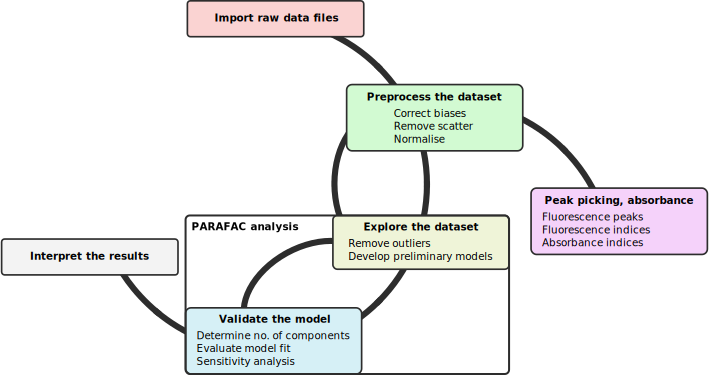

```{r, message=FALSE, warning=FALSE, include=FALSE}
library(knitcitations)
library(dplyr)
library(tidyr)
cleanbib()
options("citation_format" = "pandoc")
bibliography() #style="apalike"
library(staRdom)
library(knitr)
library(kableExtra)
cores <- 2
```

{width=180}

# Introduction
staRdom is a package for R `r citep(citation())` to analyse fluorescence and absorbance data of dissolved organic matter (DOM). The important features are:

* PARAFAC/CANDECOMP analysis can separate the components of the EEMs (`r citet("10.1039/c3ay41160e")`, `r citet(citation(package="multiway"))`).
* correcting excitation-emission-matrices (EEM, `r citet("10.1039/c3ay41160e")`, `r citet(citation(package="eemR"))`)
* calculating fluorescence peaks and indices (`r citet(citation(package="eemR"))`)
    * biological index (bix, `r citet("10.1016/j.orggeochem.2009.03.002")`)
    * so-called Coble-peaks (b,	t, a,	m, c, `r citet("10.1016/0304-4203(95)00062-3")`)
    * fluorescence index (fi, `r citet("10.4319/lo.2001.46.1.0038")`)
    * humification index (hix, `r citet("10.1021/es0155276")`)
* absorbance slope parameters (a254, a300, E2:E3, E4:E6, S275-295, S350-400, S300-700, SR and the wavelength distribution of absorption spectral slopes, `r citet("10.4319/lo.2008.53.3.0955")`, `r citet("10.1016/j.marchem.2004.02.008")`, `r citet(citation(package="cdom"))`, `r citet("10.4319/lo.2009.54.2.0590")`)

staRdom was developed and is maintained at WasserCluster Lunz (http://www.wcl.ac.at/index.php/en/) and the University of Natural Resources and Life Sciences, Vienna(http://www.boku.ac.at/).

The analysis process was developed and discussed in other papers and tutorials. The aim of this package was to bring an elaborated way of using PARAFAC analysis on EEM data to the R platform. The offered functions follow the concept of `r citet("10.1039/c3ay41160e")`. Reading it is recommended and can help your understanding!

For easy data correction, peak and indices calculation and slope parameters without using R functions code please see [vignette for basic analysis](Basic_analysis_of_DOM_samples.html). For information on eemR and its functions please see the [eemR vignette](https://CRAN.R-project.org/package=eemR). Details on the actual PARAFAC calculation can be found in the [multiway documentation](https://CRAN.R-project.org/package=multiway).

## Aim of this document

> This file describes a complete fluorescence and absorbance analysis using R functions and offers a lot of options and ways how the analysis can be done to gain validated results.

## Parallel processing

Some of the functions can use several CPU cores parallel to speed up the calculations. You can set the number of parallel processes to be used.
Here, we use half of the available threads, which should be similar to the number of physical cores.

```{r eval=FALSE, include=TRUE}
cores <- parallel::detectCores()/2
```

## Overview of analysis steps

The diagram below shows the most important steps in the analysis of fluorescence and absorbance data to identify DOM parameters. After importing the data and applying the desired correction steps, peaks, indices and absorbance parameters can be calculated. Besides that, after the data correction, compounds can be separated using a PARAFAC model. The PARAFAC model development includes cyclical steps to come to a satifying result. Model validation is very important at that point to get trsutful results. As a last step, the compounds determined in the model can be linked to already published ones and by that interpreted in a biogeochemical context.

{width=100%}

# Example data coming with the package

You can run a complete data correction and analysis as showen in this example with the data provided by the package.

## Raw EEM data

The data is saved in a folder and accessible by `system.file("extdata/cary/scans_day_1", package = "eemR")`. Due to package size issues, only a small amount of samples is included and not all examples from this tutorial will deliver the same results. A PARAFAC analysis is more stable when more samples are used but a lot of samples would cause the package to be unneccessarily large.

## Raw absorbance data

The absorbance data is saved in a folder accesible by `system.file("extdata/absorbance_eemR",package = "staRdom")`.

## Additional raw data

There is a table with an example of how to deal with diluted samples included.
The data is saved in a folder accesible by `system.file("extdata/metatable_eemR.csv",package = "staRdom")`.

## Corrected EEM data

A set of EEM samples was corrected and can be loaded into your R environment by `data(eem_list)`

## PARAFAC model

An already calculated PARAFAC model was added to the package. It can be loaded into the R environment by `data(pfres_comps1.rda)` where outliers are still included and by `data(pfres_comps2.rda)` without the outliers.

```{r eval=FALSE, include=FALSE}
data(eem_list) # load example data
```
# Import raw data

EEM data import is done with `eem_read` (package eemR). Currently you can use it to import from Cary Eclipse, Aqualog, Fluoromax-4 and Shimadzu instruments. Files can be read recursively but file names must be unique.

```{r eval=TRUE, include=TRUE}
folder <- system.file("extdata/cary/scans_day_1", package = "eemR") # load example data
eem_list <- eem_read(folder)
```

To have a look at your data, you can plot the samples.
```{r eval=TRUE, fig.width=7, message=FALSE, warning=FALSE, include=TRUE, paged.print=TRUE}
ggeem(eem_list)
```

Absorbance data is imported with `absorbance_read`. It is read from CSV or TXT files. The column header containig the wavelength must be either "wavelength" or "Wavelength". A multi-sample file must have sample names as column names. A single-sample file can have sample name as column name or sample name as file name and "Abs." as column name. All tables are combined to one with one wavelength column and one column for each sample containing the absorbance data.

```{r eval=TRUE, include=TRUE}
data(absorbance) # load example data
```

Dilution factors were saved in a table to demonstrate cases where dilution factors vary between samples.

```{r eval=TRUE, include=TRUE}
meta <- read.table(system.file("extdata/metatable_eemR.csv",package = "staRdom"), header = TRUE, sep = " ", dec = ".", row.names = 1) # load example data
```

## Check data
The data can be checked for possible incorrect entries. The results are to help you to reorganise your data and revise the steps above in case of any problems. No correction of these problems is done automatically!
Checks are done on NAs in data, duplicate and invalid sample names, wavelength range mismatches, missing data, inconsistencies in samples names between EEM, absorbance and metadata (like samples missing in one of the three sets) and missing correction methods. The `eem_checkdata` function can be run any time during the process to see if any changes in the dataset caused inconsistencies.

```{r eval=TRUE, include=TRUE}
problem <- eem_checkdata(eem_list,absorbance,meta,metacolumns = c("dilution"),error=FALSE)
```

The mentioned absance of absorbance data for the nano sample can be justified, as absorbance of MilliQ is nearly 0 over the complete spectrum.

# Data preparation and correction

I you used the template for the peak picking ([vignette for basic analysis](Basic_analysis_of_DOM_samples.html)), the correction is already done and you can start a PARAFAC analysis with the `eem_list` resulting from that.

## Sample names

If you want to change your sample names, you can use `eem_name_replace` for that. In the example, "(FD3)" is removed as it is not part of the samples names but could be in the file names. You can use this function for any replacement in file names. Regular expressions can be used.

```{r eval=TRUE, include=TRUE}
eem_list <- eem_name_replace(eem_list,c("\\(FD3\\)"),c(""))
```

## Absorbance baseline correction

The instrumental baseline drift in absorbance data can be removed by subtracting the mean of the absorbance at high wavelengths. The default is to use the spectrum between 680 and 700 nm but any other range can be set manually.

```{r eval=TRUE, include=TRUE}
absorbance <- abs_blcor(absorbance,wlrange = c(680,700))
```

## Blank correction

Blanks are samples of milliq that must contain one of "nano", "miliq", "milliq", "mq" or "blank" in their file names. They are used on the samples in the same (sub)folders. If multiple blanks were measured, they are averaged. Blanks are subtracted from each sample to reduce the effects of scatter bands and systematic errors `r citep("10.1039/c3ay41160e")`.

```{r eval=TRUE, include=TRUE}
eem_list <- eem_remove_blank(eem_list)
```

```{r eval=TRUE, fig.width=7, message=FALSE, warning=FALSE, include=TRUE, paged.print=TRUE}
ggeem(eem_list)
```

## Inner-filter effect correction

Inner-filter effects (IFE) occure when excitation light is absorbed by chromophores. A simple method to correct the IFE is to use the sample's absorbance. The EEM is multiplied by a correction matrix corresponding to each wavelength pair `r citep("10.4319/lom.2013.11.616")`. In case of a total absorbance greater than 1.5, the sample has to be diluted because otherwise, the linear relationship is not appropriate anymore. The example uses a length of cuvette of absorption measurment of 5 cm.

```{r eval=TRUE, include=TRUE}
eem_list <- eem_ife_correction(eem_list,absorbance, cuvl = 5)
```
```{r eval=TRUE, fig.width=7, message=FALSE, warning=FALSE, include=TRUE, paged.print=TRUE}
ggeem(eem_list)
```

## Raman normalisation

Fluorescence is normalised to a standard scale of Raman Units by dividing all intensities by the area of the Raman peak of a MilliQ sample. It makes data from different fluorometers or different settings on the same fluorometer comparable. Depending on where you get the data from, you can use blanks, numeric values or data frames as source for the values.

```{r eval=TRUE, include=TRUE}
eem_list <- eem_raman_normalisation2(eem_list, blank = "blank")
```

```{r eval=TRUE, fig.width=7, message=FALSE, warning=FALSE, include=TRUE, paged.print=TRUE}
ggeem(eem_list)
```

Raman areas can be calculated separately with the function `eem_raman_area`.

## Remove blanks from sample set

From this step on, blanks are not needed anymore. You can remove them from your sample set.

```{r eval=TRUE, include=TRUE}
eem_list <- eem_extract(eem_list, c("nano", "miliq", "milliq", "mq", "blank"),ignore_case = TRUE)

absorbance <- select(absorbance, -matches("nano|miliq|milliq|mq|blank", ignore.case = TRUE))
```

## Remove and interpolate scattering

The function removes scattering from the samples. `remove_scatter` is a logical vector where values are ordered by the meaning of "raman1", "raman2", "rayleigh1" and "rayleigh2". `remove_scatter_width` is either a number or a vector containing 4 different values, one for each scatter type. `r citep(list("10.1039/c3ay41160e","10.1007/978-0-387-46312-4"))`

```{r eval=TRUE, include=TRUE}
remove_scatter <- c(TRUE, TRUE, TRUE, TRUE)
remove_scatter_width <- c(15,15,15,15)

eem_list <- eem_rem_scat(eem_list, remove_scatter = remove_scatter, remove_scatter_width = remove_scatter_width)
```

```{r eval=TRUE, fig.width=7, message=FALSE, warning=FALSE, include=TRUE, paged.print=TRUE}
ggeem(eem_list)
```

Removed scatter areas can be interpolated `r citep("10.1016/j.chemolab.2015.01.017")`. `eem_interp` offeres different methods of interpolation. The types of interpolation are (0) setting all NAs to 0, (1) excitation wavelength-wise interpolation with pchip, (2) excitation and emission wavelength-wise interpolation with pchip and subsequent mean, (3) spline interpolation with interp and (4) linear interpolation in 2 dimensions with na.approx and again subsequent mean calculation. Calculating the mean is a way of ensuring NAs are also interpolated where missing boundary values would make that impossible.

```{r eval=TRUE, include=TRUE}
eem_list <- eem_interp(eem_list, cores = cores, type = 3)
```

```{r eval=TRUE, fig.width=7, message=FALSE, warning=FALSE, include=TRUE, paged.print=TRUE}
ggeem(eem_list)
```

## Care for dilution

```{r eval=TRUE, include=TRUE}
dil_data <- meta["dilution"]

eem_list <- eem_dilution(eem_list,dil_data)
```

```{r eval=TRUE, fig.width=7, message=FALSE, warning=FALSE, include=TRUE, paged.print=TRUE}
ggeem(eem_list)
```

## Smooth data

Depending on your instrument smoothing the data could be beneficial for peak picking. For PARAFAC analysis this might not be the case because noise is then just visible in the residuals. The parameter `n` specifies the moving average window size in nm. 

```{r eval=TRUE, include=TRUE}
eem4peaks <- eem_smooth(eem_list, n = 4)
```

```{r eval=TRUE, fig.width=7, message=FALSE, warning=FALSE, include=TRUE, paged.print=TRUE}
ggeem(eem4peaks)
```

## Overview of samples

```{r}
summary(eem_list)
```


```{r eval=FALSE, include=FALSE}
eem_list %>%
    summary() %>%
    kable(format = "latex", booktabs = T) %>%
    kable_styling(bootstrap_options = c("striped", "hover"), full_width = FALSE) %>%
    #kable_styling(font_size = 5) %>%
    row_spec(0, angle = -45) #%>%
```

# Peak picking and indices

There can be warnings about not present wavelengths but usually the interpolation of these values works fine.

```{r eval=TRUE, warning=FALSE, include=TRUE}

bix <- eem_biological_index(eem4peaks)
coble_peaks <- eem_coble_peaks(eem4peaks)
fi <- eem_fluorescence_index(eem4peaks)
hix <- eem_humification_index(eem4peaks, scale = TRUE)

indices_peaks <- bix %>%
  full_join(coble_peaks, by = "sample") %>%
  full_join(fi, by = "sample") %>%
  full_join(hix, by = "sample")

indices_peaks
```

```{r eval=FALSE, include=FALSE, echo=FALSE}
  kable(indices_peaks %>% mutate_if(is.numeric,prettyNum,digits = 2,format="fg"),format = "latex", booktabs = T) %>%
    kable_styling(bootstrap_options = c("striped", "hover"), full_width = FALSE) %>%
    #kable_styling(font_size = 5) %>%
    row_spec(0, angle = 45) #%>%
```

# Absorbance slope parameters

```{r eval=TRUE, include=TRUE}
slope_parms <- abs_parms(absorbance, cuvl = 1, cores = cores)
slope_parms
```

```{r eval=FALSE, include=FALSE, echo=FALSE}
  kable(slope_parms %>% mutate_if(is.numeric,prettyNum,digits = 2,format="fg"),format = "latex", booktabs = T) %>%
    #kable_styling(bootstrap_options = c("striped", "hover"), full_width = FALSE) %>%
    #kable_styling(font_size = 5) %>%
    row_spec(0, angle = 45) #%>%
```

# Creating a PARAFAC model

Finding an appropriate PARAFAC model is an iterative process. So in the model calculation process you start over and over again using different parameters. For comparing different methods, the same dataset and way of analysis was used as in the drEEM tutorial which is an appendix to `r citet("10.1039/c3ay41160e")`.

## Loading data

The package comes with some example data but to keep the package size low, according to the drEEM tutorial, some outliers and the data below 250 nm excitation and above 580 nm emission were already removed. 

```{r include=TRUE}
data(eem_list) # load example data
```

Scattering still has to be removed and is done as described above.
```{r include=TRUE}
eem_list <- eem_rem_scat(eem_list, remove_scatter = c(TRUE, TRUE, TRUE, TRUE), remove_scatter_width = c(15,15,18,19), interpolation = FALSE, cores = cores)
```

If you used the [basic analysis template](Basic_analysis_of_DOM_samples.html), you can use the resulting data right away. In case you did several analyses and want to combine the samples you can use `eem_import_dir` to combine EEM samples from several RData files. Put all of them in one folder and run the following:

```{r include=TRUE,eval=FALSE}
eem_list <- eem_import_dir(dir)
```

Due to package size issues, no example data is included for this function.

You might reuse `eem_checkdata` before continuing the further analysis!

## Find and remove noise in EEM data
An important way of finding noise in EEM data is viewing the samples. You can use the function `eem_overview_plot` to view all your samples in a convenient way. 
Data can be removed or set to NA in different ways depending on what you would like to do:
* `eem_extract` removes whole samples either by name or by number.
* `eem_range` removes data outside the given wavelength ranges in all samples.
* `eem_red2smallest` removes data in EEMs that is present in all samples. This is important for a PARAFAC analysis because the algorithm needs matrices of similar size and "shape".
* `eem_exclude` removes data in terms of samples, excitation and emission wavelengths. It is intended to be used while determining outliers in the PARAFAC model.
* `eem_rem_scat` and `eem_remove_scattering` are used to set data in Raman and Rayleigh scattering of 1st and 2nd order to NA. They differ in syntax.
* `eem_setNA` replaces data by NA in rectangular shape and in specific samples.
* `eem_matmult` multiplies each EEM matrix by a certain matrix. This matrix can be used to set parts of the data to 0 or NA (e.g. the area where emission wavelength is shorter than excitation wavelength).
* `eem_interp` is used to interpolate data previously set to NA.

Sample "667sf" will be used to show this process graphically. To extract the sample the regex "^667sf$" is used. ^ stands for the beginning of the string and \$ for the end. If you do not used those characters, all samples including the given string are extracted. This might be helpful in some cases, but in others you need to use them to get the appropriate step done.
This is what we start from:

```{r include=TRUE}
eem_list %>% 
  eem_extract(sample = "^667sf$", keep = TRUE) %>%
  ggeem()
```

The noisy range below 250 nm excitation and 58 0nm emission can be removed from the samples with the following command. As mentioned above, this was already done with the example data.
```{r eval=FALSE, message=FALSE, warning=FALSE, include=TRUE}
eem_list <- eem_range(eem_list, ex = c(250,Inf), em = c(0,580))
```
```{r message=FALSE, warning=FALSE, include=FALSE}
eem_example <- eem_list %>% 
  eem_extract(sample = "^667sf$", keep = TRUE) %>%
  `eem_names<-`("667sf_2_cut") %>%
  eem_bind(eem_example,.)
```

Visually found unusual areas are replaced by NA and interpolated. In paticular, from sample 1 ("667sf") a band covering excitation wavelengths 245 to 350 is removed and a rectangle covering emission wavelengths 560 to 576 and excitation wavelengths 280 to 295 is removed in all samples. For demonstration reasons, the interpolation is done in an extra step but can also be included in the removing function right away.

```{r}
eem_list <- eem_list %>%
  eem_setNA(sample = 176, ex = 345:350, interpolate = FALSE) %>%
  eem_setNA(em = 560:576, ex = 280:295, interpolate = FALSE)
```
```{r message=FALSE, warning=FALSE, include=FALSE}
eem_example <- eem_list %>% 
  eem_extract(sample = "^667sf$", keep = TRUE) %>%
  `eem_names<-`("667sf_3_rem_noise") %>%
  eem_bind(eem_example,.)
```
```{r}
eem_list <- eem_interp(eem_list, type = 3, cores = cores)
```
```{r message=FALSE, warning=FALSE, include=FALSE}
eem_example <- eem_list %>% 
  eem_extract(sample = "^667sf$", keep = TRUE) %>%
  `eem_names<-`("667sf_4_interp") %>%
  eem_bind(eem_example,.)
```

```{r echo=FALSE, message=FALSE, warning=FALSE, fig.width=7}
ggeem(eem_example)
```

## Explore dataset
From this point on, `eem_list` is used. It contains already corrected data processed in the same way as above.

It is crucial to find an appropriate number of components in the analysis. If the number of components is too large, one component could be separated into two, if it is too low, relevant components get lost. To help you comparing the different numbers, a series of PARAFAC models can be calculated and compared. In this case 5 models ranging from 3 to 7 components are calculated.

The analysis can happen to find local minima so a certain number of similar models with differnt random starting values is calculated and the best is kept for further steps. `nstart` is the number of these models and 4 might by a good start although for a profound analysis higher values (e.g. 20) are suggested.

You can speed up the calculations by using multiple `cores`. Beware, that calculating a PARAFAC model can take some time!

Higher `maxit` and lower `ctol` increase the accuracy of the model but need more computation time.

In this first model creation step, the constraints are tested. While `pf1` is calculated without any constraints, `pf1n` uses the assumption that modes are non-negative only. Possible constraints are none ("uncons"), non-negative ("nonneg") and unimodal, non-negative ("uninon"). Besides these common ones, other possible constraints can be seen using the command `CMLS::const()`.

PARAFAC modes can be rescaled so their maximum is 1 and effects are more visible in the plots. The rescaling is corrected in the A mode (sample mode).

In case of uneven peak heights, `eempf_rescaleBC` can help you imporving your graphs. The parameter `newscale` specifies the root mean-squared error of each column in matrices B and C. This is compensated in the A-mode (sample loadings). Alternatively `newscale` can be set `"Fmax"`, each peak has a height of 1 then.

```{r include=TRUE}
# minimum and maximum of numbers of components
dim_min <- 3
dim_max <- 7
```

```{r eval=FALSE,include=TRUE}
nstart <- 16 # number of similar models from which best is chosen
maxit = 1000 # maximum number of iterations in PARAFAC analysis
ctol <- 10^-5 # tolerance in PARAFAC analysis

# calculating PARAFAC models, one for each number of components
pf1 <- eem_parafac(eem_list, comps = seq(dim_min,dim_max), normalise = FALSE, const = c("uncons", "uncons", "uncons"), maxit = maxit, nstart = nstart, ctol = ctol, cores = cores)

pf1n <- eem_parafac(eem_list, comps = seq(dim_min,dim_max), normalise = FALSE, const = c("nonneg", "nonneg", "nonneg"), maxit = maxit, nstart = nstart, ctol = ctol, cores = cores)

# rescale B and C modes
pf1 <- lapply(pf1, eempf_rescaleBC, newscale = "Fmax")
pf1n <- lapply(pf1n, eempf_rescaleBC, newscale = "Fmax")
```

To see the results from the model created using the whole sample set, you can use the generated PARAFAC model inculded in the package.
```{r include=TRUE}
data(pf_models)
```

Plot created model's components. You can see the models fits and the components (rows) according to models with different numbers of components (columns) in 2 different views. The single plots can be created using `eempf_fits` and `eempf_plot_comps`.

```{r eval=TRUE, include=TRUE, fig.width=7, fig.height=6}
eempf_compare(pf1)
```
```{r eval=TRUE, include=TRUE, fig.width=7, fig.height=6}
eempf_compare(pf1n)
```

Comparing the two different approaches concerning constraints, the models with non-negative modes show much clearer results and are prefered in this case.

## Check the correlation between different components

The PARAFAC algorithm assumes no correlation between the components. In case you did not normalise your samples, doing it could decrease the correlation. The model with 6 components (4th model in the list) is used for now.

```{r eval=TRUE, include=TRUE, fig.width=7}
# check for correlation between components table
eempf_cortable(pf1n[[4]])
```
```{r eval=TRUE, include=TRUE, fig.width=7, fig.height=6}
eempf_corplot(pf1n[[4]], progress = FALSE)
```

As some of the components are highly correlated, the model is calculated again with normalised sample data.

```{r eval=FALSE,include=TRUE}
pf2 <- eem_parafac(eem_list, comps = seq(dim_min,dim_max), normalise = TRUE, const = c("nonneg", "nonneg", "nonneg"), maxit = maxit, nstart = nstart, ctol = ctol, cores = cores)

# rescale B and C modes
pf2 <- lapply(pf2, eempf_rescaleBC, newscale = "Fmax")
```
```{r eval=TRUE, include=TRUE, fig.width=7, fig.height=6}
eempf_compare(pf2)
```

## Find and exclude outliers leverage

The leverage is calculated by `eempf_leverage` and can be plotted with `eempf_leverage_plot`. Using `eempf_leverage_ident` to plot the leverage shows an interactive plot where you can klick an certain values to save them in a variable. `qlabel` defines the size of the upper percentile that is labeled in the plots. `eempf_mleverage` can be used to compare the leverages of samples in differnt models.

```{r fig.width=7}
# calculate leverage
cpl <- eempf_leverage(pf2[[4]])
# plot leverage (nice plot)
eempf_leverage_plot(cpl,qlabel=0.1)
# plot leverage, not so nice plot but interactive to select what to exclude
# saved in exclude, can be used to start over again with eem_list_ex <- eem_list %>% eem_exclude(exclude) above
exclude <- eempf_leverage_ident(cpl,qlabel=0.1)
```

Here, the exclude list is specify manually to keep track of what was done.

```{r eval=TRUE, include=TRUE}
# samples, excitation and emission wavelengths to exclude, makes sense after calculation of leverage
exclude <- list("ex" = c(),
                "em" = c(),
                "sample" = c("sfb676psp","sgb447wt")
)

# exclude outliers if neccessary. if so, restart analysis
eem_list_ex <- eem_exclude(eem_list, exclude)
```

A new PARAFAC model is then generated without samples and wavelengths identified as outliers:

```{r eval=FALSE, include=TRUE}
pf3 <- eem_parafac(eem_list_ex, comps = seq(dim_min,dim_max), normalise = TRUE, maxit = maxit, nstart = nstart, ctol = ctol, cores = cores)
pf3 <- lapply(pf3, eempf_rescaleBC, newscale = "Fmax")
```
```{r eval=TRUE, include=TRUE, fig.width=7, fig.height=6}
eempf_compare(pf3)

eempf_leverage_plot(eempf_leverage(pf3[[4]]),qlabel=0.1)
```

## Examine residuls

The outliers determined above are included to show the difference in residuals. Analysing these residuals can show deficites in model creation, problems with sample handling and lab equipment or already be helpful in answering scientific questins.

```{r eval=TRUE, include=TRUE, fig.width=7, fig.height=6}
eempf_residuals_plot(pf3[[4]], eem_list, residuals_only = TRUE, select = eem_list %>% eem_names() %>% .[c(1:16,205,208)], spp = 9, cores = cores)
```

## Recalculating the model with increased accurracy

```{r eval=FALSE, include=TRUE}
ctol <- 10^-8 # tolerance in PARAFAC analysis

pf4 <- eem_parafac(eem_list_ex, comps = seq(dim_min,dim_max), normalise = TRUE, const = c("nonneg", "nonneg", "nonneg"), maxit = maxit, nstart = nstart, ctol = ctol, cores = cores)

pf4 <- lapply(pf4, eempf_rescaleBC, newscale = "Fmax")
```
```{r eval=TRUE, include=TRUE, fig.width=7, fig.height=6}
eempf_compare(pf4)

eempf_leverage_plot(eempf_leverage(pf4[[4]]))

eempf_corplot(pf4[[4]], progress = FALSE)
```

Please redo these steps unless you are satisfied with the results!

## Plot the resulting components and loadings

```{r eval=TRUE, include=TRUE, fig.width=7, fig.height=6}
eempf_comp_load_plot(pf4[[4]])
#eempf_plot_comps(pf4[4], type = 2)
```

Separate plots can be generated by using `ggeem` for components and `eempf_load_plot` for the loadings.

It is possible to view the components in 3D using `eempf_comps3D`.

## Plotting samples and residuals

The plots shows samples in columns and the rows show the components (6 in that case), the residuals and the whole sample.

```{r eval=TRUE, include=TRUE, fig.width=7, fig.height=8}
# plot components in each sample, residual and whole sample
eempf_residuals_plot(pf4[[4]], eem_list, select = eem_names(eem_list)[10:14], cores = cores)

```

## Split-half analysis

The split-half analysis is intended to show the stability of your model. The data is recombined in 6 different ways and results from each subsample should be similar.

```{r eval=FALSE, include=TRUE}
#calculate split_half analysis
sh <- splithalf(eem_list_ex, 6, normalise = TRUE, rand = FALSE, cores = cores, nstart = nstart, maxit = maxit, ctol = ctol)
```

Split-half analysis takes some time, so the results are included in the package.

```{r eval=TRUE, include=TRUE, fig.width=7}
data(sh)
```

Plotting results from the split-half analysis. Your model is stable, if the graphs of all components look quite similar.

```{r eval=TRUE, include=TRUE, fig.width=7}
splithalf_plot(sh)
```

If some splits look similar (or see below, have a Tucker's congruency coefficient close to 1) and others do not, this is a strong hint that the particular splits might be responsible for unstable conditions. In the example, the periodical splits (`rand = FALSE`) show one split, where no stable model could be found. Changing these manually (using the parameter `splits = ...`) or randomly (`rand = TRUE`, see below) can give more reliable results.

```{r eval=FALSE, include=TRUE}
sh_r <- splithalf(eem_list_ex, 6, normalise = TRUE, rand = TRUE, cores = cores, nstart = nstart, maxit = maxit, ctol = ctol)
```
```{r eval=TRUE, include=TRUE, fig.width=7}
splithalf_plot(sh_r)
```

Tucker's Congruency Coefficients is a value for their similarity and `splithalf_tcc` returns a table showing the values. 1 would be a perfect similarity.

```{r eval=TRUE, include=TRUE, fig.width=7}
tcc_sh_table <- splithalf_tcc(sh_r)

tcc_sh_table
```

## Further model validation

### Core consistancy

As a way of model validation the core consistancy can be calculated. The core consistency is sometimes not considered a good parameter for model quality. Please see `r citet("10.1039/c3ay41160e")` for a discussion on that.

```{r eval=TRUE, include=TRUE, fig.width=7}
corcondia <- eempf_corcondia(pf4[[4]], eem_list_ex)

corcondia
```

### EEMqual

EEMqual according to `r citet("10.1016/j.chemolab.2010.06.005")` can be calculated.

```{r eval=TRUE, include=TRUE, fig.width=7}
eemqual <- eempf_eemqual(pf4[[4]], eem_list_ex, sh_r, cores = cores)

eemqual
```

# Model export and interpretation

## Comparing your data using openfluor.org

You can use `eempf_openfluor` to export a file that can be uploaded to openfluor.org `r citet("10.1039/c3ay41935e")`. Please check the file header manually after export as some values cannot be determined automatically. Openfluor offers ways to compare your components to those found in other publications. This is a very important step in interpreting the results and coming to ecologic conclusions.

```{r eval=FALSE, include = TRUE}
eempf_openfluor(pf4[[4]], file = "my_model_openfluor.txt")
```

## Creating a report on your analysis
The report created by `eempf_report` contains important settings and results from your analysis and is exported as an html file. You can specify the information you want to include.

```{r eval=FALSE, include = TRUE}
eempf_report(pf4[[4]], export = "my_model_openfluor.txt", eem_list = eem_list, shmodel = sh, performanec = TRUE)
```

## Exporting the model
Using `eempf_export` you can export your model matrices to a csv file.

`eem_metatemplate` is intended as a list of samples and a template for a table containing metadata. Writing this table to a file easens the step of gathering needed values for all samples.

## Combine results and care for dilution issues

`eem_dilcorr` creates a table containing information on how to handle diluted samples. Absorbance spectra need to be replaced by undiluted measurements preferably or multiplied by the dilution factor. Names of EEM samples can be adjusted to be similar to their undiluted absorbance sample. You can choose for each sample how you want to proceed on the command line. The table contains information about these two steps.

`eem_absdil` takes information from the table generated by `eem_dilcorr` and multiplies or deletes undiluted absorbance sample data.

`eem_eemdil` takes information from the table generated by `eem_dilcorr` and renames EEM samples to match undiluted absorbance samples.

# References
```{r, message=FALSE, warning=FALSE, include=FALSE}
write.bibtex(file="references2.bib")
```

  

